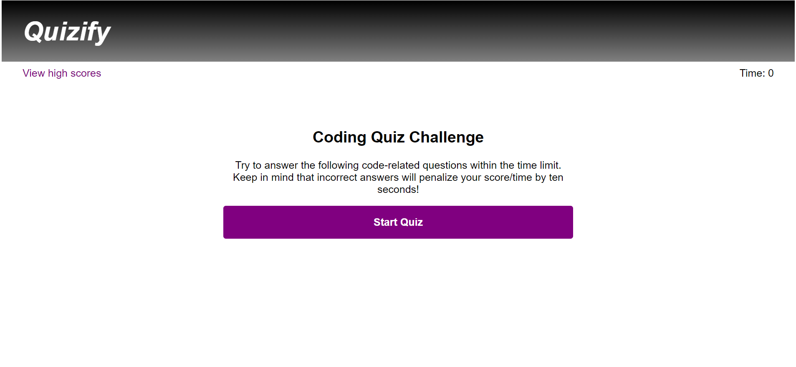
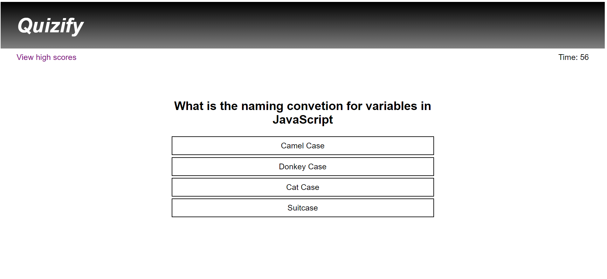
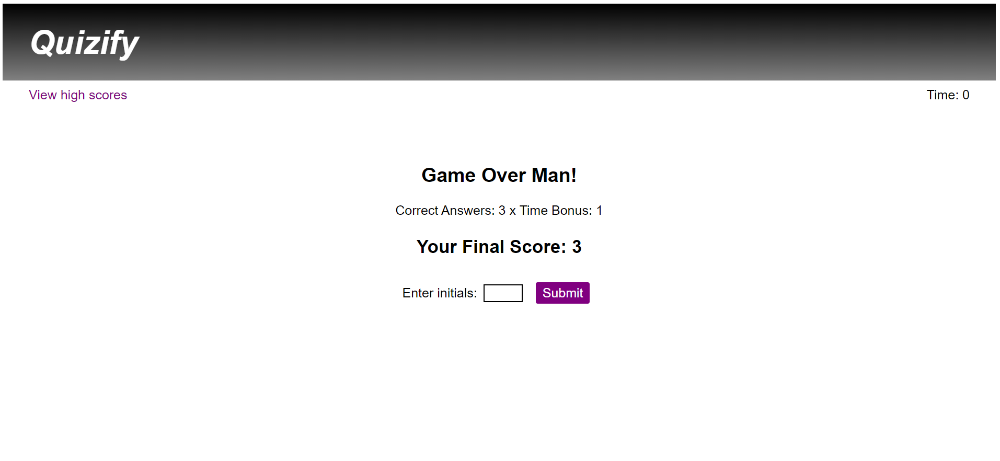
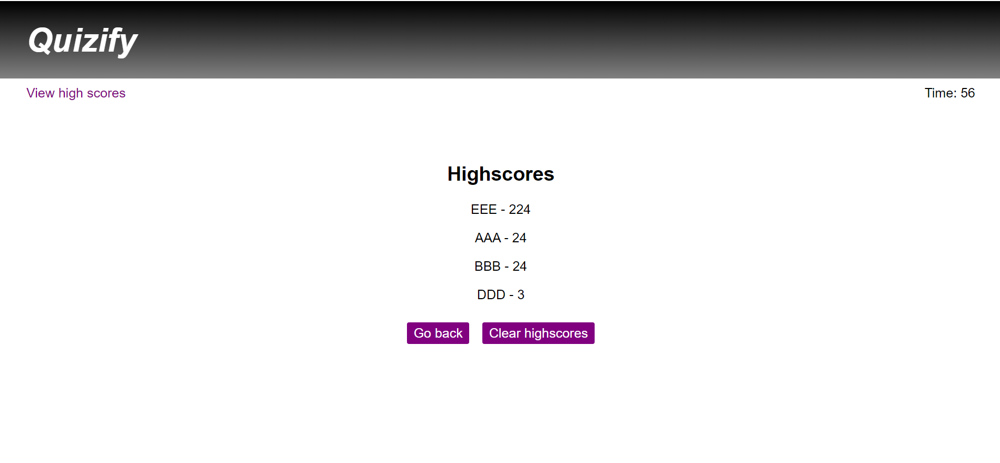

# Quizify

## About This Project

This project is a short quiz about JavaScript. It was built using HTML, CSS, and JavaScript. The majority of the website's content is generated using JavaScript rather than HTML, to allow the content to be dynamic.

The key features are:
* A start screen which gives the user a brief idea of the rules
* When the game starts, a timer begins, and the user has 60 seconds to answer as many of the multiple choice questions correctly as they can - each question has 4 possible answers
* The timer will lose 10 seconds when the user gets a question wrong
* A feedback message appears to let the user know if they answered correctly or not
* Once all questions have been answered or the timer runs out, the user is given their highscore (based on both the time left and correct answers) and can enter their initials into the highscore table
* The highscore table displays highscores from highest to lowest, and the scores can be reset

Areas for improvement:
* There are only 4 questions currently, but this could be easily expanded
* Some code is repetitive and could be re-factored, but this would likely involve changing the data structure of the questions/answers
* It would be nice to randomize the questions to make it less predictable, and randomize the order of the answers, so that no 2 games are alike
* Display a warning when the user clicks the "view highscores" button during gameplay, that the game will exit

---

## Screenshots

Landing page/start screen - options to view the highscores or start the game

An example question screen, where the user can choose from 1 of 4 answers

The user is presented with their final score and prompted to enter their initials (up to 3 characters)

Highscores page displays the highscores and corresponding user initials in decending order

---

## Links
[Project Code on Github](https://github.com/philmcgarty/quizify "Github")

[Deployed Site](https://philmcgarty.github.io/quizify)
